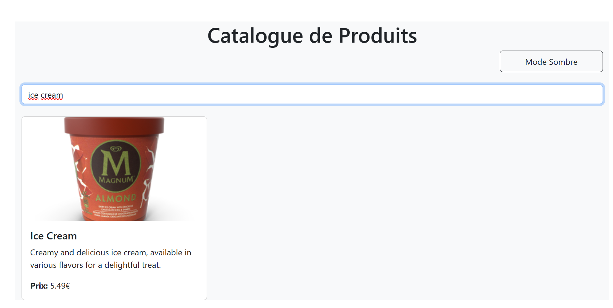
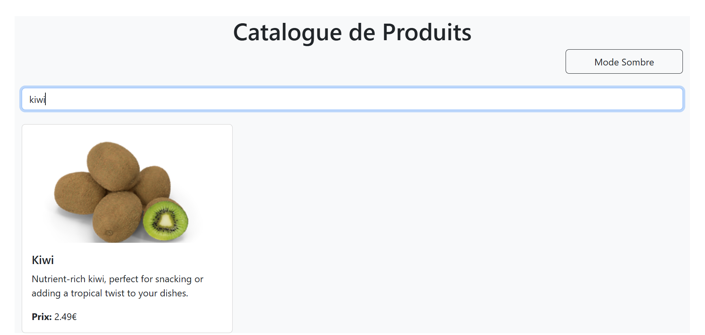
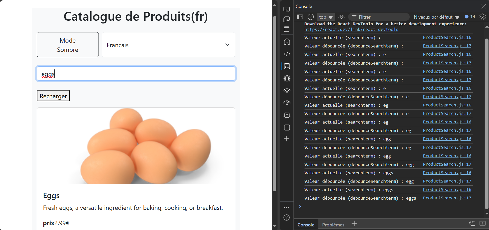
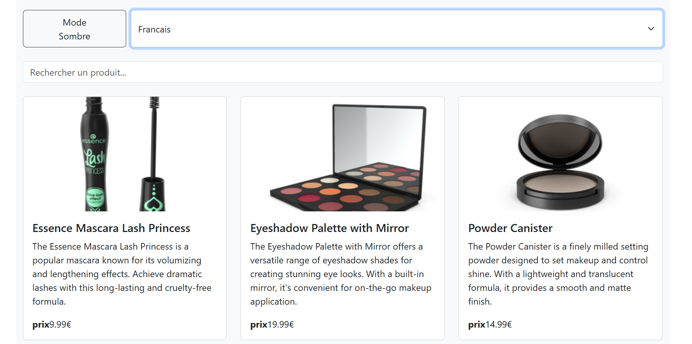
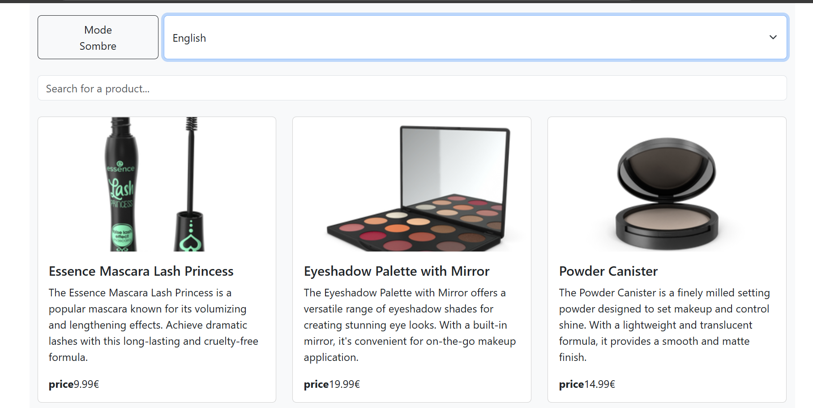
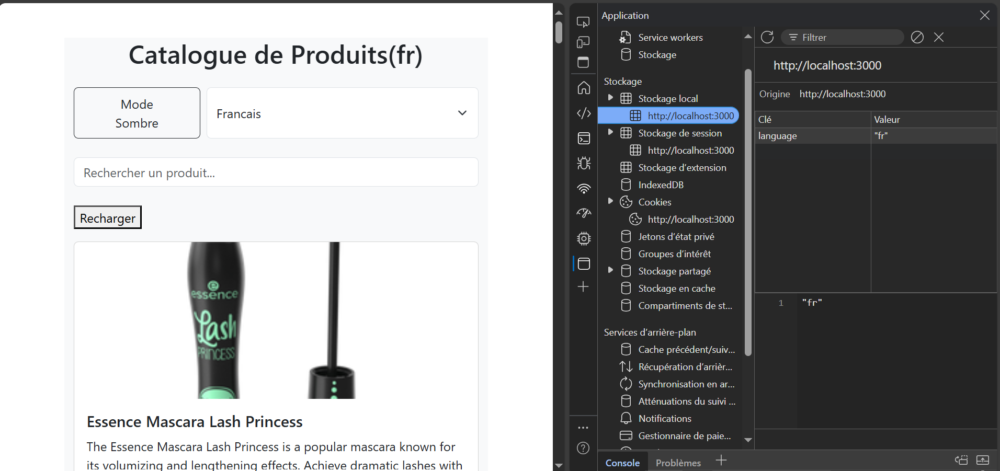
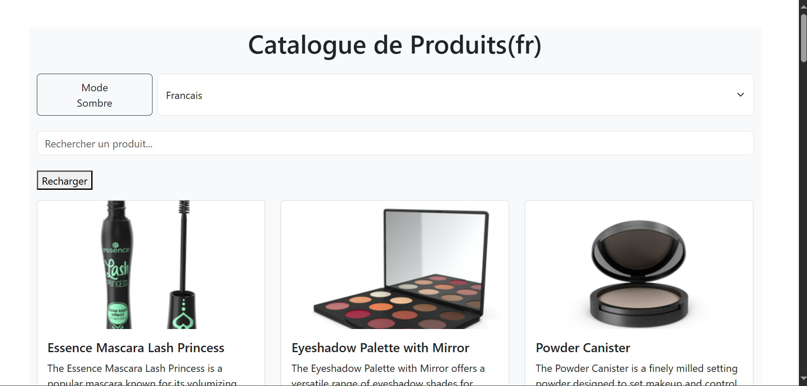
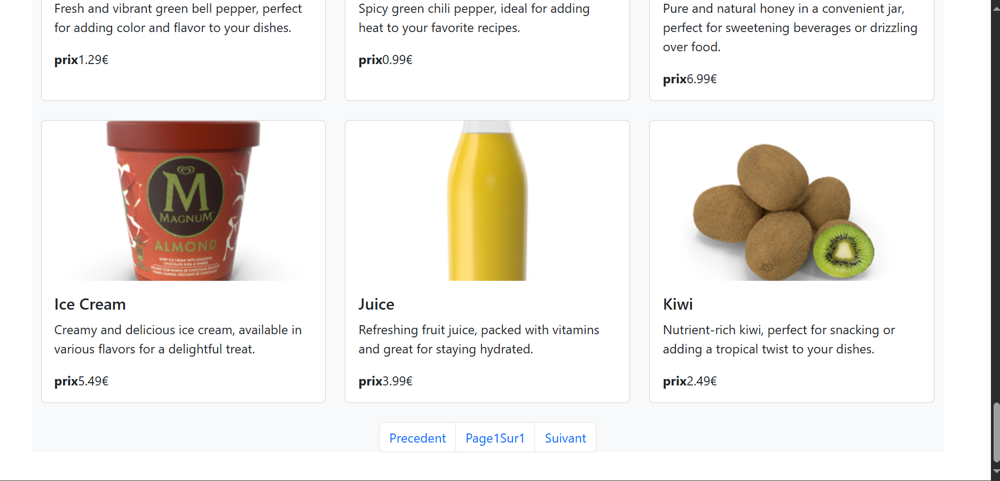

<h1>TP React Hooks - Application de Gestion de Produits</h1>
<h3>Exercice 1 : État et Effets</h3>
<h4>1.1 Modification du composant ProductSearch pour l'utiliser dans la recherche:</h4>

Dans cette 1ere partie, on a modifié le composant
ProductSearch pour qu’il reçoit deux props : searchTerm
et setSearchTerm. Ces deux éléments qui viennent d’un composant parent
et qui vont permettre de gérer la recherche en temps réel. À chaque
fois que l’utilisateur tape dans le champ de recherche, setSearchTerm
est appelé pour mettre à jour la valeur, et cette valeur est utilisée pour
filtrer la liste des produits. Et grâce à cela, le filtrage se fait dynamiquement
dès que l'utilisateur tape une lettre.
Voici deux exemples qui montrent la recherche des deux produits(ice cream , kiwi):

<h4>1.2 Implémentation du debounce dans la recherche:</h4>
Pour améliorer la performance, on a implémenté un système de debounce afin d’éviter
la répétition de la recherche qu'elle fasse à chaque frappe du clavier. On a utilisé un
setTimeout combiné à useEffect pour attendre quelques millisecondes après que
l’utilisateur finit de taper avant de lancer la recherche.
Voici un exemple qui montre l'effet d'eviter la répétition lors de la recherche d'eggs.Comme on peut voir dans la console,lorsqu'on comemence
à taper les lettres, ils se sont stockés dans la valeur debounce jusqu'à ce qu'on termine de taper le produit recherché, cela juste pour éviter la recherche à chaque fois.

<h3>Exercice 2 : Context et Internationalisation</h3>
<h4>2. Création du LanguageContext et l'ajout du sélecteur de langue:</h4>

LanguageContext permet de gérer la langue de l’interface d'une manière globale dans l’application (français ou anglais).
On a utilisé useContext(LanguageContext) dans ProductSearch pour récupérer la langue actuelle, et on a affiché le placeholder du champ de recherche ainsi que le mot "Prix" dans la langue correspondante (fr ou en).
L'exemple suivant montre le changement de la langue lorsqu'on selectionne la langue francaise et la langue d'anglais.

<h5>Difficulté rencontrée :</h5>

Au début, j’ai oublié d’englober mon application dans le LanguageContext.Provider, donc la valeur language était undefined. Une fois corrigé, tout est bien fonctionné.

<h3>Exercice 3 : Hooks Personnalisés</h3>
<h4>3. Création du hook useDebounce et le hook useLocalStorage:</h4>

Dans cet exercice,on a utilisé deux hooks personnalisés : useDebounce et useLocalStorage.
Le hook useDebounce a déjà été expliqué précédemment, il nous permet d'améliorer les performances de la recherche en évitant les appels trop fréquents lors de la saisie.
Quant au hook useLocalStorage, il nous a permis de stocker la langue choisie par l’utilisateur dans le localStorage du navigateur,et grâce à cela, la langue reste
sauvegardée même après un rafraîchissement de la page. En testant dans la console, on a bien retrouvé la valeur "fr" enregistrée, ce qui confirme le bon fonctionnement du hook.

<h3>Exercice 4 : Gestion Asynchrone et Pagination</h3>
<h4>4. L'ajout du bouton de rechargement et l'implémentation de la pagination:</h4>

Dans cette exercice ,on a ajouté un bouton de rechargement pour réinitialiser l'affichage des produits, permettant ainsi de remettre à zéro les filtres ou la recherche en cours. Cela facilite la gestion de l'état des produits sans affecter d'autres parties de l'application.De plus on a également implémenté la pagination afin de diviser les produits en plusieurs pages, améliorant ainsi la lisibilité et la performance de l'application.

